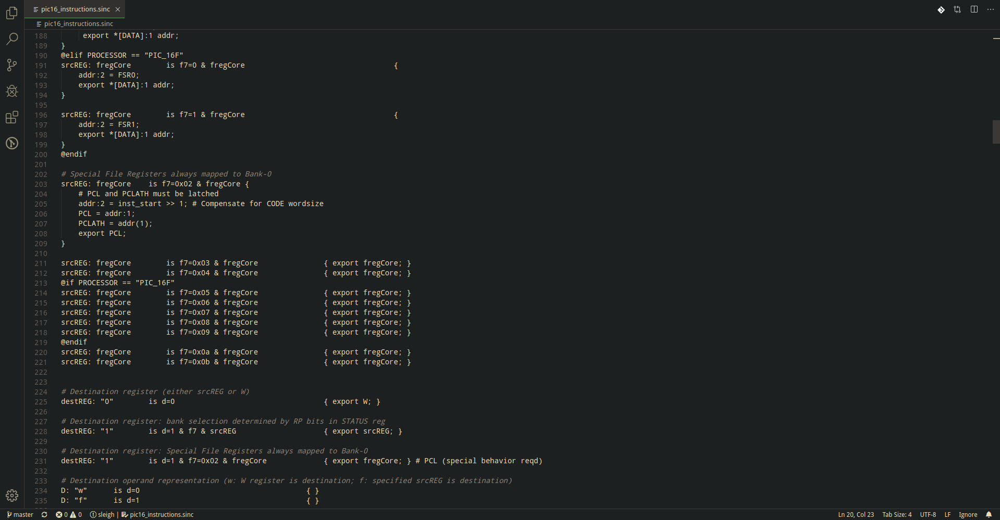
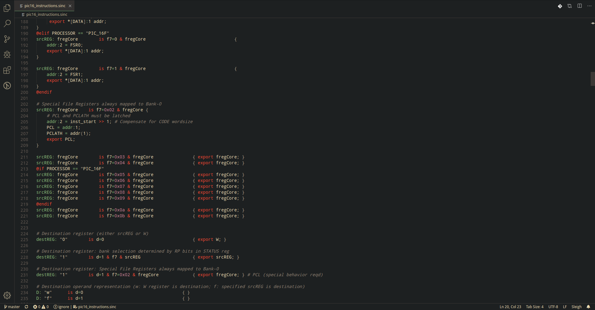

# SleigHighlight 

Language highlighting for GHIDRA processor definition language Sleigh, because writing processor specification is tedious. So tedious that life might lose colors, go below to [Motivation](#Motivation) to find out how bad it could be.

 ## BORING

## NON BORING

Install this as you would do with any normal VScode extension. Nothing difficult.

# Development

To launch VScode with this extension loaded for development use:
`code --extensionDevelopmentPath=this_project_folder ./your_sleigh_project`

To debug the grammar use:
`Developer: Inspect TM Scopes`

To reload the grammar use:
`CTRL + R`

# Feature Development

It should be easy to port this extension to eclipse, as the underling tokenizer engine is the same (textmate). I haven't looked this up in more detail, but if you're interested feel free to ping me!

# Motivation

Writing Sleigh code without highlighting is error-prone. Because you might make errors writing code without highlighting. A plain text editor is not a tool that can be used to proficiently write code. As anyone has felt when he opened a source file in Windows' Notepad, the lack of code highlighting will not allow you to write code easily. A plain old text editor (POTE from now on) is an insufficiently sophisticated tool to help the programmer understand the constructs at a glance. Sleigh is not a natural language and hence cannot be quickly parsed by humans. Human eyes are not equipped to break down code into its meaningful parts. so many times but it is not getting to me. Even seasoned coders could ease their existence with moderate highlihting, as they are not always up to the task of parsing code. You will never make me crack. Even Jon Skeet cannot read Sleigh without highlighting without getting an headache. Every time you attempt to read code without highlighting, the unholy child weeps the blood of virgins, and Russian hackers pwn your Ghidra install. Reading Sleigh without highlighting summons tainted souls into the realm of the living. Sleigh and POTE go together like love, marriage, and ritual infanticide. The `INT_NEGATE` cannot hold it is too late. The force of Sleigh and POTE together in the same conceptual space will destroy your mind like so much watery putty. If you read code without highlighting you are giving in to Them and their blasphemous ways which doom us all to inhuman toil for the One whose Name cannot be expressed in the Basic Multilingual Plane, he comes. Plain gray Sleigh will liquify the n​erves of the sentient whilst you observe, your psyche withering in the onslaught of horror. The lack of Sleigh h̸i̸g̸h̶l̷i̶g̴h̶t̴i̵n̶g̴ is the cancer that is killing reverse engineering. _it is too late it is too late we cannot be saved_ the trangession of a chi͡ld ensures Sleigh will consume all living tissue (except for Sleigh which it cannot, as previously prophesied) _dear lord help us how can anyone survive this scourge_ writing Sleigh without highlighting has doomed humanity to an eternity of dread torture and painful reversing *using POT*E as a tool to write Sleigh establishes a brea**ch between this world** and the dread realm of c͒ͪo͛ͫrrupt entities (like SGML entities, but _more corrupt) a mere glimp*se of a gray text edi​***tor with Sleigh code in it will ins***​tantly transport a p*rogrammer's consciousness i*nto a w*orl*d of ceaseless screaming, he comes, the pestilent slithy Sleigh-infection wil​**l devour your intenti**​ons, firmware binary dump and existence for all time like Visual Basic only worse **he comes he com**es **do not fi**​ght h**e com̡e̶s, ̕h̵i**​s un̨ho͞ly radiańcé de_stro҉ying all enli̍̈́̂̈́ghtenment, Sleigh p-codes **lea͠ki̧n͘g fr̶ǫm ̡yo​͟ur eye͢s̸ ̛l̕ik͏e liq**​uid pain, the song of reading Slei̸g will exti​nguish the voices of mor​**tal man from the sp**​here I can see it can you see ̲͚̖͔̙î̩́t̲͎̩̱͔́̋̀ it is beautiful t​he f`inal snuf`fing o*f the lie​**s of Man ALL IS LOŚ͖̩͇̗̪̏̈́T A**_**LL I​S L**OST th_e pon̷y he come*s he c̶̮omes he co**mes t*he* ich​**or permeat*es al*l MY FAC*E MY FACE ᵒh god n**o NO NOO̼*****O​O N**Θ stop t*he an​*̶͑̾̾​̅ͫ͏̙̤g͇̫͛͆̾ͫ̑͆l͖͉̗̩̳̟̍ͫͥͨ_e̠̅s `͎a̧͈͖r̽̾̈́͒͑e` n**​ot rè̑ͧ̌aͨl̘̝̙̃ͤ͂̾̆ ZA̡͊͠͝LGΌ ISͮ̂҉̯͈͕̹̘̱ T**O͇̹̺ͅƝ̴ȳ̳ TH̘**Ë͖́̉ ͠P̯͍̭O̚​N̐Y̡ H̸̡̪̯ͨ͊̽̅̾̎Ȩ̬̩̾͛ͪ̈́̀́͘ ̶̧̨̱̹̭̯ͧ̾ͬC̷̙̲̝͖ͭ̏ͥͮ͟Oͮ͏̮̪̝͍M̲̖͊̒ͪͩͬ̚̚͜Ȇ̴̟̟͙̞ͩ͌͝**S̨̥̫͎̭ͯ̿̔̀ͅ

But now, thanks to this extension, your CPU architecture definition proficiency will skyrocket! And you'll mental health will be ḿ̶̸̨̯̞̩̼̯̖̗̯̳͍͎̺̝̲̳̼͍ͅą͖̯͎̪̦̱͇̠̜̩͚̲͕̲͘r͘҉̡҉̭̣̤̻̰̱̰̻̫͙̀ͅv̸̺̭͓̬̮̼͈͟͟͝͠ȩ̴̛̛͔̩̥͍̗l̶̴̴̨̻̮̪̰̫̳̺͍͈͇̣̟̻͡o̴̷̧͎͇͕̺̟̪̳̫̮͈̙̝̮͝ͅu͖͉͓͇̠̞̲͢ͅs̷̘̝̻̜̞̘͎͔̣̟̞̱̮͈̗̹͖̯̕!